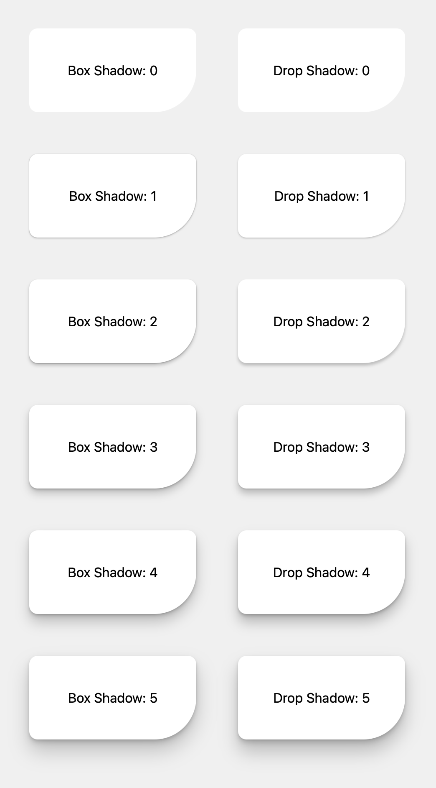

# Effective Shadow

<p align="center">
  
</p>

<p align="center">
  <strong>Mathematically generated, multi-layered CSS shadows.</strong><br/>
  Not guesswork — calculated Bézier curves for natural depth.
</p>

<p align="center">
  <a href="https://www.npmjs.com/package/@effective/shadow"></a>
  <a href="https://www.npmjs.com/package/@effective/shadow"></a>
  <a href="https://github.com/sebastian-software/effective-shadow/actions"></a>
  <a href="https://github.com/sebastian-software/effective-shadow/blob/main/LICENSE"></a>
</p>

<p align="center">
  <a href="https://sebastian-software.github.io/effective-shadow/"><strong>🎨 Interactive Demo →</strong></a>
</p>

---

## The Problem with CSS Shadows

Most shadow implementations — including popular frameworks — share the same issues:

1. **Single-layer shadows look flat.** A shadow with one uniform blur doesn't match how light behaves in the real world.

2. **Values are often arbitrary.** Teams copy values from Stack Overflow or tweak numbers until "it looks okay". There's no underlying system.

3. **`box-shadow` and `drop-shadow` don't match.** They use different blur algorithms (box vs. Gaussian), so the same values produce different results. Most developers don't even know this.

4. **Scaling is inconsistent.** Going from "small" to "large" shadows often means arbitrary jumps rather than a harmonious progression.

---

## Our Approach: Calculated, Not Guessed

**Effective Shadow** doesn't just provide presets — it's a **calculation engine** based on real principles:

### Bézier-Curved Layer Distribution

Instead of linear steps, we use Bézier curves to distribute shadow layers. This creates the smooth falloff you see in natural shadows: sharper near the object, softer further away.

```
Layer 1: ░░░░░░░░░░  (subtle, close to element)
Layer 2: ░░░░░░░░    (medium distance)
Layer 3: ░░░░░░      (stronger)
Layer 4: ░░░░        (deepest, most diffuse)
━━━━━━━━━━━━━━━━━━━━━━━━━━━━━━━━━━━━━━━━━━━━
Combined: Natural shadow with realistic depth
```

### Harmonic Progression

Each elevation level follows a mathematical progression (~1.5-2× the previous), not arbitrary jumps:

| Level | Name        | Offset | Blur | Layers |
| ----- | ----------- | ------ | ---- | ------ |
| 1     | Subtle lift | 1px    | 2px  | 3      |
| 2     | Low         | 2px    | 4px  | 3      |
| 3     | Raised      | 3px    | 6px  | 4      |
| 4     | Floating    | 5px    | 10px | 4      |
| 5     | Overlay     | 8px    | 16px | 5      |
| 6     | Modal       | 14px   | 28px | 6      |
| 7     | Peak        | 24px   | 48px | 7      |

### Calibrated Cross-Technique Output

`box-shadow` and `filter: drop-shadow()` render differently — box blur vs. Gaussian blur, linear vs. [exponential stacking](https://css-tricks.com/getting-deep-into-shadows/). We apply mathematically derived modifiers so both techniques produce consistent visual results from the same input parameters.

---

## Use as Presets or as a Tool

### Ready-to-Use Presets

```bash
npm install @effective/shadow
```

```tsx
import "@effective/shadow/shadows.css"

<div className="shadow-4">Elevated card</div>

```

### Tailwind Plugin

```js
// tailwind.config.js
import effectiveShadow from "@effective/shadow/tailwind"

export default {
  plugins: [effectiveShadow]
}
```

### Build Your Own System

The real power is the calculation engine. Define your own elevation scale:

```typescript
import { buildShadow, toBoxShadow, toDropShadow } from "@effective/shadow"

// Your custom configuration
const shadow = buildShadow({
  shadowLayers: 5,
  finalOffsetY: 12,
  finalBlur: 24,
  finalAlpha: 0.15,
  // Bézier curves for distribution
  offsetEasing: [0.4, 0, 0.2, 1],
  blurEasing: [0.4, 0, 0.2, 1],
  alphaEasing: [0.2, 0.5, 0.8, 0.5]
})

// Works for both shadow types
element.style.boxShadow = toBoxShadow(shadow)
element.style.filter = toDropShadow(shadow) // Automatically calibrated
```

**[→ Experiment in the interactive playground](https://sebastian-software.github.io/effective-shadow/#playground)**

---

## Compared to Other Systems

We've analyzed the shadow implementations of major design systems:

|                       | Effective | Tailwind | ShadCN | Material 3 | Radix  |
| --------------------- | --------- | -------- | ------ | ---------- | ------ |
| **Layers**            | 3-7       | 1-2      | 2      | 3          | 1-2    |
| **Distribution**      | Bézier    | Linear   | Linear | Stepped    | Linear |
| **Calculation basis** | Formula   | Manual   | Manual | Spec-based | Manual |
| **Customizable**      | Full API  | Config   | Config | Tokens     | CSS    |

**[→ Visual side-by-side comparison](https://sebastian-software.github.io/effective-shadow/#comparison)**

---

## Box Shadow vs Drop Shadow

Both have their place:

|                       | `box-shadow`               | `drop-shadow`                           |
| --------------------- | -------------------------- | --------------------------------------- |
| **Shape**             | Rectangular bounding box   | Follows actual element contours         |
| **Best for**          | Cards, buttons, containers | Icons, SVGs, transparent images         |
| **Text shadows**      | Not applicable             | Works on text glyphs directly           |
| **Combined elements** | Shadow around container    | Unified shadow around all visible parts |
| **Performance**       | CPU-rendered               | GPU-accelerated                         |

`drop-shadow` is particularly useful for text and icon+text combinations where you want a single unified shadow rather than a box around the container.

**[→ Interactive demo comparing both](https://sebastian-software.github.io/effective-shadow/#box-vs-drop)**

---

## Colored Shadows

Create eye-catching CTAs with colored shadows:

```typescript
import { buildShadow, toBoxShadow } from "@effective/shadow"

const shadow = buildShadow({
  shadowLayers: 4,
  finalOffsetY: 12,
  finalBlur: 24,
  finalAlpha: 0.5
})

// Indigo glow effect
const ctaShadow = toBoxShadow(shadow, 3, { color: "99, 102, 241" })
```

---

## Technical Foundation

The library is built on research from:

- [Josh Comeau's shadow design principles](https://www.joshwcomeau.com/css/designing-shadows/)
- [Tobias Ahlin's layered shadow technique](https://tobiasahlin.com/blog/layered-smooth-box-shadows/)
- [CSS-Tricks on shadow stacking behavior](https://css-tricks.com/getting-deep-into-shadows/)
- [Bjango's cross-platform shadow matching](https://bjango.com/articles/matchingdropshadows/)
- [Material Design 3 elevation principles](https://m3.material.io/styles/elevation/overview)
- Philipp Brumm's smooth shadow generator (concept inspiration)

---

## Contributing

```bash
git clone https://github.com/sebastian-software/effective-shadow.git
cd effective-shadow
pnpm install
pnpm dev      # Start demo
pnpm test     # Run tests
pnpm build    # Build library
```

See [CONTRIBUTING.md](CONTRIBUTING.md) for guidelines.

---

## License

[Apache License 2.0](LICENSE) — Free for personal and commercial use.

---

<p align="center">
  Built by <a href="https://www.sebastian-software.de">Sebastian Software</a>
</p>
